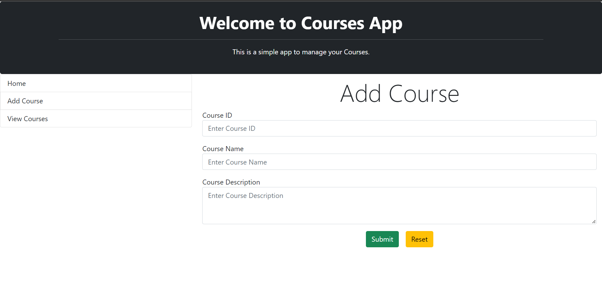
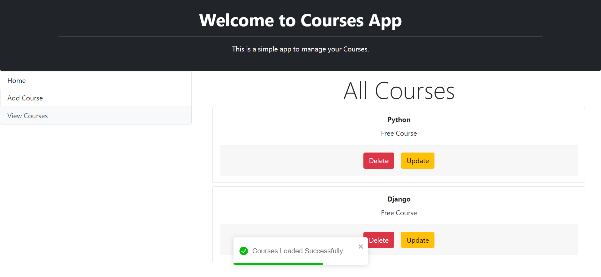

# Courses Application

A learning project for managing courses with a React frontend and Spring Boot REST API backed by MySQL.

## Features

- Browse, add, and delete courses from the React interface.
- Create, read, update, and delete courses through the REST API.
- Persist course IDs, titles, and descriptions with Spring Data JPA.

## Project Structure

```text
Courses App/    React frontend
Spring Rest/    Spring Boot REST API and JPA persistence
Docs/           Repository documentation and screenshots
```

## Run Locally

### Prerequisites

- Node.js and npm
- Java 17
- MySQL

### Backend

1. Create a MySQL database.
2. Update [`Spring Rest/src/main/resources/application.properties`](Spring%20Rest/src/main/resources/application.properties) with its URL, username, and password.
3. Start the API:

   ```bash
   cd "Spring Rest"
   sh ./mvnw spring-boot:run
   ```

The API runs at `http://127.0.0.1:9090` by default.

### Frontend

```bash
cd "Courses App"
npm install
npm start
```

The development server opens the application at `http://localhost:3000` and calls the local API at port `9090`.

## API

| Method | Path | Purpose |
| --- | --- | --- |
| `GET` | `/courses` | List courses |
| `GET` | `/courses/{courseId}` | Get one course |
| `POST` | `/courses` | Create a course |
| `PUT` | `/courses` | Update a course |
| `DELETE` | `/courses/{courseId}` | Delete a course |

## Screenshots

| Add a course | Browse courses |
| --- | --- |
|  |  |

## Contributing

See [CONTRIBUTING.md](CONTRIBUTING.md) for local development conventions.
